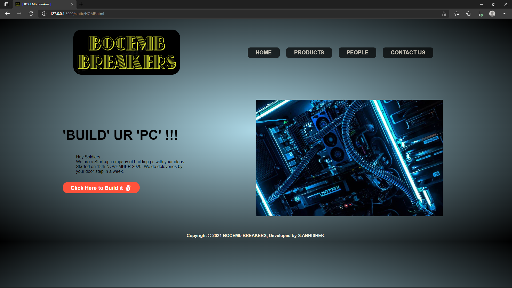

# Web Design for a Software Product Company

## AIM:

To design a static website for a software product company company.

## DESIGN STEPS:

### Step 1:

Requirement collection.

### Step 2:

Creating the layout using HTML and CSS.

### Step 3:

Updating the sample content.

### Step 4:

Choose the appropriate style and color scheme.

### Step 5:

Validate the layout in various browsers.

### Step 6:

Validate the HTML code.

### Step 6:

Publish the website in the given URL.

## PROGRAM :

### HOME PAGE:
```
<!DOCTYPE html>
<html>
    <head>
    <title> | BOCEMb Breakers | </title>
    <link rel="stylesheet" href="./css/layout.css">
        <link rel="icon" href="./img/logo.png" type="image/x-icon">
    </head>
<body>
<div class="container">
<div class="home">    
    <div class="logo">
        
    </div>
    <nav>
        <ul>
            <li><a href="HOME.html" class="btn1">HOME</a></li>
            <li><a href="products.html" class="btn1">PRODUCTS</a></li>
            <li><a href="people.html" class="btn1">PEOPLE</a></li>
            <li><a href="contact.html" class="btn1">CONTACT US</a></li>
        </ul>
    </nav>
</div>
<div class="row">
    <div class="col-2">
        <br>
        <h1>'BUILD' UR 'PC' !!!</h1><br>
        <p>Hey Soldiers ,<br> We are a Start-up company of building pc with your ideas.<br>Started on 18th NOVEMBER 2020.     We do deleveries by <br>your door-step in a week.</p>
        <a href="products.html" class="btn">Click Here to Build it &#9996;</a>
    </div>
    <div class="col-2">
        
    </div>
    <div class="footer">
        Copyright &#169; 2021 BOCEMb BREAKERS, Developed by S.ABHISHEK.
      </div>
</div>
</div>
</body>
</html>
```

### PRODUCTS PAGE:
```
<!DOCTYPE html>
<html>
    <head>
    <title> | BOCEMb Breakers | </title>
    <link rel="stylesheet" href="./css/layout.css">
        <link rel="icon" href="./img/logo.png" type="image/x-icon">
    </head>
<body>
<div class="container">
<div class="home">    
    <div class="logo">
        
    </div>
    <nav>
        <ul>
            <li><a href="HOME.html" class="btn1">HOME</a></li>
            <li><a href="products.html" class="btn1">PRODUCTS</a></li>
            <li><a href="people.html" class="btn1">PEOPLE</a></li>
            <li><a href="contact.html" class="btn1">CONTACT US</a></li>
        </ul>
    </nav>
</div>
</div>
<!------------- featured ones---------->
<div class="featured">
    <h2>MOST SELLING PRODUCTS</h2>
    <div class="small-container">
    <div class="row">
        
    <div class="col-3">
        
        <h3>CORSAIR 4X8 GB RAM</h3>
        <p>PRICE : 11,999 INR</p>
    </div>
        
    <div class="col-3">
        
        <h3>VENGEANCE 2X8 GB RAM</h3>
        <p>PRICE : 7,000 INR</p>
    </div>
    <div class="col-3">
        
        <h3>HYPER X FURY 1X8 GB RAM</h3>
        <p>PRICE : 4,029 INR</p>
    </div>
    <div class="col-3">
        
        <h3>INTEL CORE i9 10th GEN UNLOCKED</h3>
        <p>PRICE : 48,999 INR</p>
    </div>
    <div class="col-3">
        
        <h3>INTEL CORE i9 X-SERIES</h3>
        <p>PRICE : 330 INR</p>
    </div>
    <div class="col-3">
        
        <h3>INTEL CORE i5 10th GEN</h3>
        <p>PRICE : 21,999 INR</p>
    </div>
    <div class="col-3">
        
        <h3>NVIDIA GEFORCE GTX 1650 4 GB GRAPHICS CARD</h3>
        <p>PRICE : 34,999 INR</p>
    </div>
    <div class="col-3">
        
        <h3>NVIDIA GEFORCE RTX 2060 6 GB GRAPHICS CARD</h3>
        <p>PRICE : 65,999 INR</p>
    </div>
    <div class="col-3">
        
        <h3>NVIDIA GEFORCE RTX 3060 12 GB GRAPHICS CARD</h3>
        <p>PRICE : 99,999 INR</p>
    </div>
    <div class="col-3">
        
        <h3>WD 1 TB HDD</h3>
        <p>PRICE : 3,829 INR</p>
    </div>
    <div class="col-3">
        
        <h3>BARRACUDA SEAGATE 2 TB HDD</h3>
        <p>PRICE : 6,999 INR</p>
    </div>
    <div class="col-3">
        
        <h3>SAMSUNG 128 GB SSD + 256 GB SSD</h3>
        <p>PRICE : 9,899 INR</p>
    </div>
        <div class="footer">
        Copyright &#169; 2021 BOCEMb BREAKERS, Developed by S.ABHISHEK.
      </div>
    </div>
    </div>
</div>
</body>
</html>
```

### PEOPLE PAGE:
```
<!DOCTYPE html>
<html>
    <head>
    <title> | BOCEMb Breakers | </title>
    <link rel="stylesheet" href="./css/layout.css">
        <link rel="icon" href="./img/logo.png" type="image/x-icon">
    </head>
<body>
<div class="container">
<div class="home">    
<div class="logo">
    
</div>
    <nav>
        <ul>
            <li><a href="HOME.html" class="btn1">HOME</a></li>
            <li><a href="products.html" class="btn1">PRODUCTS</a></li>
            <li><a href="people.html" class="btn1">PEOPLE</a></li>
            <li><a href="contact.html" class="btn1">CONTACT US</a></li>
        </ul>
    </nav>
</div>
</div>
<!--------People------>
<div class="featured">
    <h2>OUR ARMY</h2>
    <div class="small-container">
    <div class="row">
        
    <div class="col-3">
        
        <h3>Mr. S.ABHISHEK</h3>
        <h4>(Managing Director)</h4>
    </div>
        
    <div class="col-3">
        
        <h3>Mr. P.SYAM TEJ</h3>
        <h4>(Assisstant Director)</h4>
    </div>
        <div class="col-3">
        
            <h3>Mr. V.NAVEEN KUMAR</h3>
            <h4>(General Manager)</h4>
    </div>
    <div class="col-3">
        
        <h3>Mr. M.J.ANISH</h3>
        <h4>(Assisstant Manager)</h4>
    </div>

    <div class="col-3">
        
            <h3>Ms. J.RAKSHITHA DEVI</h3>
        <h4> (Project Director) </h4>
    </div>
    <div class="col-3">
        
            <h3>Ms. V.NAVYA</h3>
        <h4>(Project Manager)</h4>
    </div>
    <div class="col-3">
        
        <h3>Mr. P.SANDEEP</h3>
        <h4>(Team Leader)</h4>
    </div>
    <div class="col-3">
        
        <h3>Mr. SYED MUHAMMED ZAHI</h3>
        <h4>(HR)</h4>
    </div>
    <div class="footer">
        Copyright &#169; 2021 BOCEMb BREAKERS, Developed by S.ABHISHEK.
      </div>
    </div>
    </div>
</div>
</body>
</html>
```

### CONTACT US PAGE:
```
<!DOCTYPE html>
<html>
    <head>
    <title> | BOCEMb Breakers | </title>
    <link rel="stylesheet" href="./css/layout.css">
    <link rel="icon" href="./img/logo.png" type="image/x-icon">
    </head>
<body>
<div class="container">
<div class="home">    
<div class="logo">
    
</div>
    <nav>
        <ul>
            <li><a href="HOME.html" class="btn1">HOME</a></li>
            <li><a href="products.html" class="btn1">PRODUCTS</a></li>
            <li><a href="people.html" class="btn1">PEOPLE</a></li>
            <li><a href="contact.html" class="btn1">CONTACT US</a></li>
        </ul>
    </nav>
</div>

<!--------CONTACT-US---------->
<div class="featured">
    <h5 class="contit">ADDRESS:</h5>
        <p>Dr.No.420,<br>
        VIVEKANANDAR STREET,DUBAI ROAD,<br>
            CHENNAI : 600 089</p>
    <br>
    <h5 class="contit">PHONE NO.:</h5>
        <p>+91 7010451###<br>
            044-2480 55##
        </p>
    <br>   
    <div class="footer">
        Copyright &#169; 2021 BOCEMb BREAKERS, Developed by S.ABHISHEK.
      </div>

    </div>
    </div>

    </body>
</html>
```

## OUTPUT:

### Home Page:



### Product Page:


### People Page:


### Contact us Page:


## Result:

Thus a website is designed for the software product company and the HTML,CSS code are validated.
